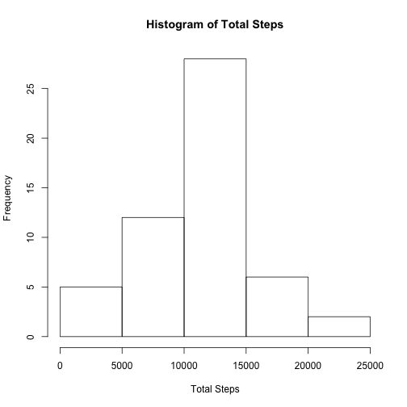
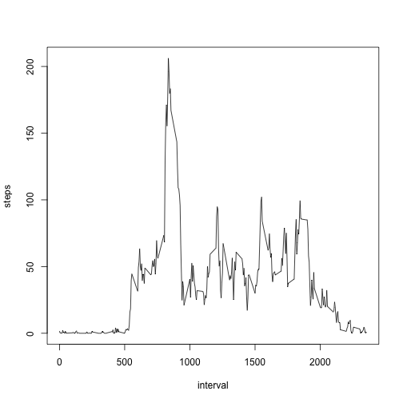
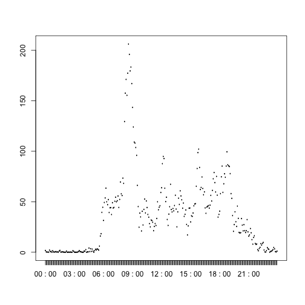
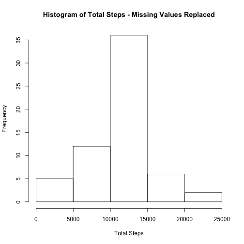
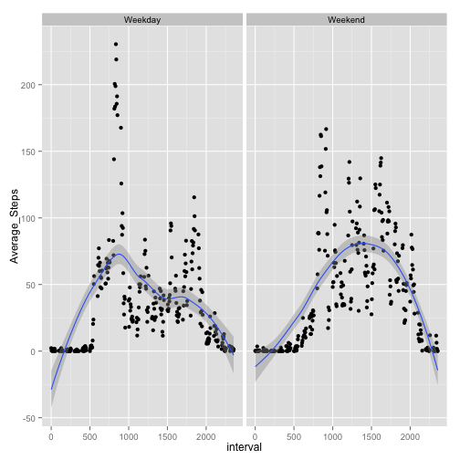

This is an R Markdown file.  The purpose of this report is to complete the first assignment for the Reproducible Research course offered by Coursera, with due date of 2/7/2016.

Data was downloaded to my device from the [project gibhub location](https://d396qusza40orc.cloudfront.net) on February 7, 2016. The data was created by a personal activity monitoring device.  According to the project instructions,

"This device collects data at 5 minute intervals through out the day. The data consists of two months of data from an anonymous individual collected during the months of October and November, 2012 and include the number of steps taken in 5 minute intervals each day.

The variables included in this dataset are:

    steps: Number of steps taking in a 5-minute interval (missing values are coded as NA)
    date: The date on which the measurement was taken in YYYY-MM-DD format
    interval: Identifier for the 5-minute interval in which measurement was taken

The dataset is stored in a comma-separated-value (CSV) file and there are a total of 17,568 observations in this dataset."

Loading and preprocessing the data.

1.  Data was loaded for processing into R, creating a dataset named "activity"


```r
setwd("~/Desktop/Coursera")

activity=read.csv("activity.csv",header=TRUE,sep=",",colClasses=c("numeric","character","numeric"))
## Confirm read is complete
str(activity)
```

```
## 'data.frame':	17568 obs. of  3 variables:
##  $ steps   : num  NA NA NA NA NA NA NA NA NA NA ...
##  $ date    : chr  "2012-10-01" "2012-10-01" "2012-10-01" "2012-10-01" ...
##  $ interval: num  0 5 10 15 20 25 30 35 40 45 ...
```

2.  Some pre-processing steps were needed.  In order to make the interval plots more readable
the interval variable was transformed into time format.


```r
## First calculate hour of day
activity=transform(activity,hour=floor(interval/100))
## Then calculate minutes past the hour
activity=transform(activity,minutes=interval-hour*100)
## Calculate time variable from the previous 2 variables
activity=transform(activity,time=paste(formatC(hour,width=2,flag="0"),":",formatC(minutes,width=2,flag="0")))
## Next step is to create Time_of_Day as time format variable in the activity dataset
activity=transform(activity,Time_of_Day=as.POSIXlt(strptime(time,"%H : %M")))
## Make date with time variable a POSIX date
library(lubridate)
activity=transform(activity,Actual_Time=ymd_hm(paste(date,time)))
## Show the header to test that the interval variable was transformed correctly (Time_of_Day variable), and aligned with its true calendar date for later use (realtime)
head(activity,10)
```

```
##    steps       date interval hour minutes    time         Time_of_Day
## 1     NA 2012-10-01        0    0       0 00 : 00 2016-02-07 00:00:00
## 2     NA 2012-10-01        5    0       5 00 : 05 2016-02-07 00:05:00
## 3     NA 2012-10-01       10    0      10 00 : 10 2016-02-07 00:10:00
## 4     NA 2012-10-01       15    0      15 00 : 15 2016-02-07 00:15:00
## 5     NA 2012-10-01       20    0      20 00 : 20 2016-02-07 00:20:00
## 6     NA 2012-10-01       25    0      25 00 : 25 2016-02-07 00:25:00
## 7     NA 2012-10-01       30    0      30 00 : 30 2016-02-07 00:30:00
## 8     NA 2012-10-01       35    0      35 00 : 35 2016-02-07 00:35:00
## 9     NA 2012-10-01       40    0      40 00 : 40 2016-02-07 00:40:00
## 10    NA 2012-10-01       45    0      45 00 : 45 2016-02-07 00:45:00
##            Actual_Time
## 1  2012-10-01 00:00:00
## 2  2012-10-01 00:05:00
## 3  2012-10-01 00:10:00
## 4  2012-10-01 00:15:00
## 5  2012-10-01 00:20:00
## 6  2012-10-01 00:25:00
## 7  2012-10-01 00:30:00
## 8  2012-10-01 00:35:00
## 9  2012-10-01 00:40:00
## 10 2012-10-01 00:45:00
```

The first question addressed is "What is the mean total number of steps taken per day?" in the data.  
1.  To answer this question, we need to create a summary of steps per day, then plot a histogram (x-axis = selected range of total steps, y-axis = frequency (as in count of days with total steps within each range).  


```r
## Summarize the activity data by date.
daytotal=aggregate(steps ~ date, data=activity, FUN="sum")
## Plot the histogram on the summarized data
hist(daytotal$steps,xlab="Total Steps",main="Histogram of Total Steps")
```

 

2.  Now calculate the mean and median total number of steps per day.  To do this we can use the summary function on the daytotal dataset.


```r
## This step will return the mean and median number of steps each day across all days
summary(daytotal)
```

```
##      date               steps      
##  Length:53          Min.   :   41  
##  Class :character   1st Qu.: 8841  
##  Mode  :character   Median :10765  
##                     Mean   :10766  
##                     3rd Qu.:13294  
##                     Max.   :21194
```


The next question we need to answer is, "What is the average daily activity pattern", that is, across the days in our data, when is average activity highest, or lowest?  Are there wide swings in activity between morning and afternoon, for example?

1.  First we plot average steps per 5 minute interval, then we do the same using the time variable we calculated during our preprocessing step.  In the second plot, the x-axis equals time which refers to the time of day when the five-minute interval begins.


```r
## Create a new summary table which summarizes activity data by interval
intervalmean=aggregate(steps ~ interval,data=activity,FUN="mean")
## Show a time series of average steps by 5-minute interval
with(intervalmean,plot(interval,steps,type="l"))
```

 

```r
## Create the table with time rather than interval then plot
timemean=aggregate(steps ~ time,data=activity,FUN="mean")
with(timemean,plot(time,steps,type="l"))
```

 

2.  Now use the summary function on the summarized data to answer the question, "Which 5 minute interval, averaged across all days in the dataset, contains the maximum number of steps?"


```r
## Find out which interval has the maximum on average
intervalmean[intervalmean$steps==max(intervalmean$steps),]
```

```
##     interval    steps
## 104      835 206.1698
```

```r
## And check that the actual time matches in the timemean dataset
timemean[timemean$steps==max(timemean$steps),]
```

```
##        time    steps
## 104 08 : 35 206.1698
```

Surprisingly, the interval with the maximum number of steps is in the interval beginning at 8:35am.

Next, we need to look into the number of NA values in the activity dataset and devise a method of dealing with them, when profiling the summary and average activity.

1.  Calculate and report the total number of missing values in the dataset (i.e. the total number of rows with NA's rather than valid integers).


```r
## This code will return the total number of NA's in the original activity dataset

sum(is.na(activity$steps))
```

```
## [1] 2304
```

2.  We will replace NA's using the average number of steps in each interval, calculated using records from the intervalmean dataset.  There is some bias in this approach, but it should yield a reasonable handling of the missing values.

3.  The following code creates the new dataset, activity2, in which NA's are replaced with the interval average


```r
## First merge activity with the intervalmean dataset on interval
activity2=merge(activity,intervalmean,by.x="interval",by.y="interval")

## Not sure this is the best way, butneeded to rename the steps.x and steps.y columns prior to the replacement of NA's
activity2=transform(activity2,ysteps=activity2$steps.y)
activity2=transform(activity2,xsteps=activity2$steps.x)

## This code replaces the NA's in the activity data set with the interval averages from interval mean dataset
activity2$xsteps[is.na(activity2$xsteps)]=activity2$ysteps[is.na(activity2$xsteps)]
```

4.  Here, the question we wish to answer is whether the replacement of NA's with average values will change the basic picture of the daily activity pattern.  First we will repeat the creation of histogram showing the effects of replacing NA.  Then we can calculate mean and median and compare these with the initial calculations.


```r
## Summarize activity2 data by date, using the new xsteps values

daytotal2=aggregate(xsteps ~ date, data=activity2, FUN="sum")
## Plot the histogram on the summarized data

hist(daytotal2$xsteps,xlab="Total Steps",main="Histogram of Total Steps - Missing Values Replaced")
```

 

```r
## This step will return the mean and median number of steps each day across all days for the revised dataset
## compared to the statistics from the unadjusted dataset
summary(daytotal2)
```

```
##      date               xsteps     
##  Length:61          Min.   :   41  
##  Class :character   1st Qu.: 9819  
##  Mode  :character   Median :10766  
##                     Mean   :10766  
##                     3rd Qu.:12811  
##                     Max.   :21194
```

```r
summary(daytotal)
```

```
##      date               steps      
##  Length:53          Min.   :   41  
##  Class :character   1st Qu.: 8841  
##  Mode  :character   Median :10765  
##                     Mean   :10766  
##                     3rd Qu.:13294  
##                     Max.   :21194
```

We conclude that the dataset statistics are somewhat different using the revised version.  The histogram shows a higher frequency in the highest frequency range.  The quartile statistics are also changed.

We have investigated the daily patterns of activity to see periods of the day for which activity is highest or lowest.  Now we wish to investigate whether patterns are different depending on day of the week.

For this section of the analysis we use the activity2 dataset, with filled-in missing values.

1.  Create a new factor variable with two levels (weekday and weekend)  For this we use the weekdays() function, then group into the two factors.


```r
## Transform the activity2 dataset to include a new column for day of the week, based on the "new" date column

activity2=transform(activity2, weekday=weekdays(Actual_Time))

## Now classify the days of the week into weekend and weekday
## Create a vector with weekend days in it
weekend=c("Saturday","Sunday")

## Categorize each day into weekend or weekday group

activity2=transform(activity2,dayfact=factor((activity2$weekday %in% weekend), levels=c(FALSE,TRUE),labels=c("Weekday","Weekend")))
```

Now we will split the data into Weekend and Weekday to plot the daily activity for comparison.


```r
## Summarize the data into weekend/weekday by interval
library(dplyr)
intervalmean2=summarize(group_by(activity2,dayfact,interval),Average_Steps=mean(xsteps))

## Now plot the time series for both groups.
library(ggplot2)
qplot(interval,Average_Steps,data=intervalmean2,facets=. ~ dayfact,geom=c("point","smooth"))
```

 

We can see that the activity between 5AM and 10AM and between 3PM and 8PM is quite different for Weekend and Weekday activity, as expected.
